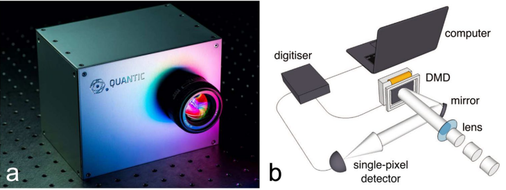
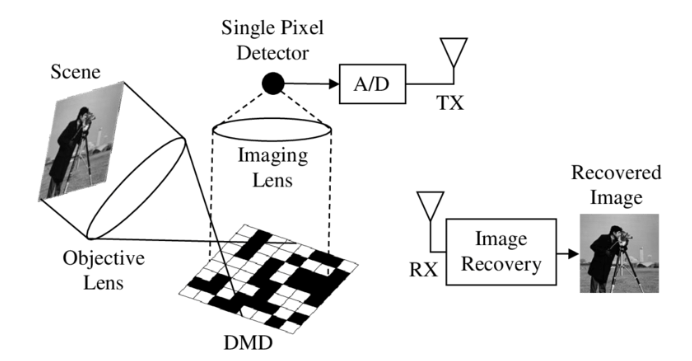

# Single Pixel Imaging
Single-pixel imaging is a new field that allows reconstructing signals from a single-pixel detector. 
The setup diagram is shown in Figure 1. This technology is mainly used in areas where it is expensive to use multi-pixel matrices to capture images.

The idea of a single-pixel camera belongs to a group of researchers from Rice University.
In 2008, they proposed installing a single-pixel camera [2] as an implementation of the compression perception method [3, 4] proposed in one of D. Donoho's articles in 2006.
The algorithm described in the article is capable of reconstructing signals from measurements with reduced sampling.
However, the proposed method of minimizing the first norm turned out to be labor-intensive, which complicated the reconstruction of images or other signals in real time. 
But after the advent of deep learning algorithms and their application to the inverse problem of single-pixel imaging, it became possible to effectively use these cameras.

### Example 1
 

### Example 2

# Single Pixel Camera

A single-pixel camera (SPC) is a camera that uses only one pixel to capture images. Unlike multi-pixel detectors, it is capable of operating in a wider spectral range. 
The SPC architecture consists of several main parts: a digital micromirror device (DMD) and a detector.
The DMD consists of a set of micromirrors that can independently orient themselves either toward the photodiode (corresponds to 1) or away from it (corresponds to 0/-1).
The SPC operating principle is as follows: the light waves of the image are collected by the first lens and reflected from the DMD, then the reflected light is collected by the second lens and focused on one photodiode (one pixel).
The operating diagram is shown in Figure 18. The voltage on the photodiode is equal to a scalar value, which is the sum of the parts of the image that were reflected from the micromirrors with a positive orientation. 
Then the position of the mirrors is randomly changed to obtain the second value. Since DMD is capable of rapidly changing pattern configurations, measurements can be obtained in a short period of time.

One of the main advantages of using this camera is that the number of measurements is significantly reduced. 
That is, there is no need to use additional compression algorithms. After all, the image is already in compressed form. And since the camera only needs one photo sensor,
it can be replaced by any other infrared or ultraviolet sensor, while building multi-pixel detectors for these wavelengths is often impossible.

# Sources
- [1] Candes, E. J. Compressed sensing / E. J. Candes, D. L. Donoho // IEEE Transactions on Information Theory. – 2006. Vol. 52 № 4. – P. 1289–1306.
- [2] Duarte, M. Single-pixel imaging via compressive sampling / M. Davenport, D. Takhar, J. Laska, T. Sun, K. Kelly, R. Baraniuk // IEEE Sig. Proc. Magazine. – 2008. Vol. 25 № 2. – P. 83–91.
- [3] Donoho, D. L. Compressed Sensing / D. L. Donogo // IEEE Transactions on Information Theory. – 2006. Vol. 52 № 4. – P. 1289–1306.
- [4] Candes, E. J. Decoding by linear programming / E. J. Candes, T. Tao // IEEE Transactions on Information Theory. – 2005. Vol. 51 № 12. – P. 4203-4215
- [5] Shin, J. Single-pixel imaging using compressed sensing and wavelength-dependent scattering // Opt. Lett. – 2016. Vol. 41 № 5. – P. 886–889.